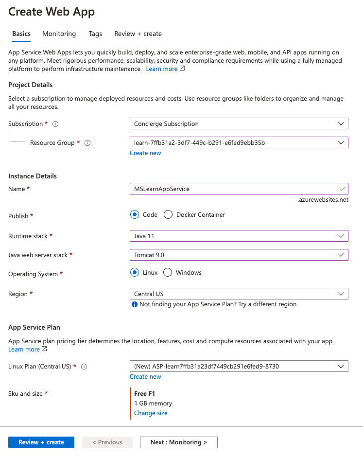
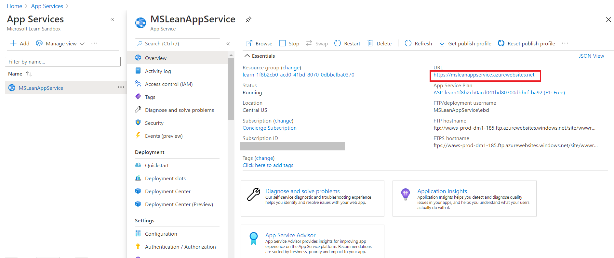
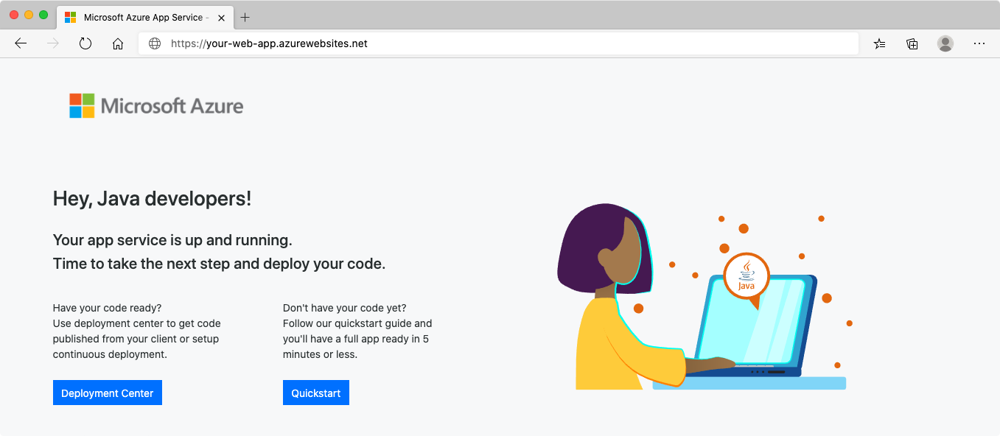
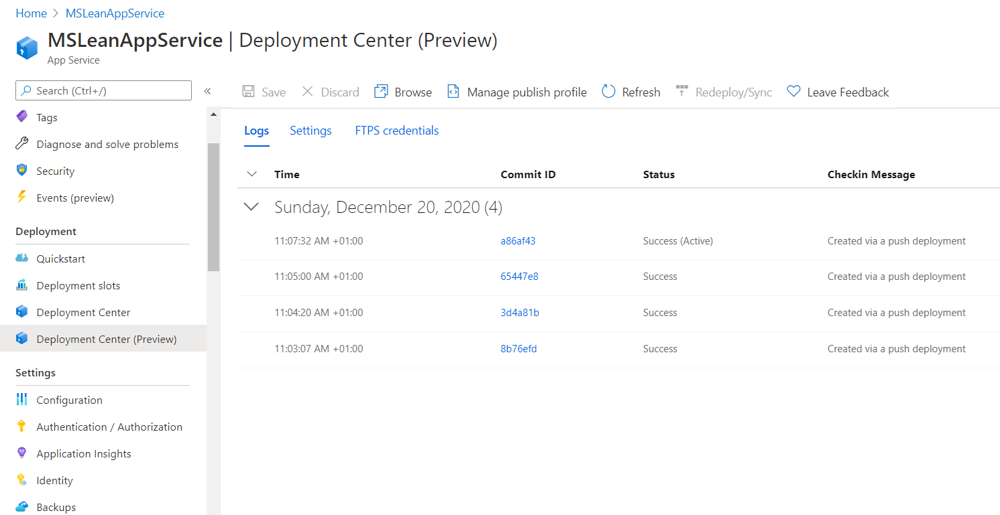

# Create and deploy a web app in the Azure portal

Details: https://docs.microsoft.com/en-us/learn/modules/host-a-web-app-with-azure-app-service/2-create-a-web-app-in-the-azure-portal

#### 1. Create a web app in the portal 



#### 2. Preview the created webb app in the portal



#### 3. Preview the new app in a brawser
Open the URL https://msleanappservice.azurewebsites.net/ in your brawser:



#### 4. Deploy your business web-app in the portal

##### 4.1 Clone a git-repo or create a new applications

```
mvn archetype:generate -DgroupId=example.demo -DartifactId=helloworld -DinteractiveMode=false -DarchetypeArtifactId=maven-archetype-webapp
```

##### 4.2 Create deployment credentials
The easiest way to create deployment credentials is from the Azure CLI. 
Run the following command in the Cloud Shell to set them up, substituting <username> and <password> with values you choose.

```
az webapp deployment user set --user-name <USER_NAME> --password <PASSWORD>
```

##### 4.3 Deploy the created app to the portal

```
cd helloworld/target
curl -v -X POST -u <USER_NAME>:<PASSWORD> https://msleanappservice.scm.azurewebsites.net/api/wardeploy --data-binary @helloworld.war
```

#### 5. View the deployed business app in a brawser


#### 6. Check the deployment in the portal


