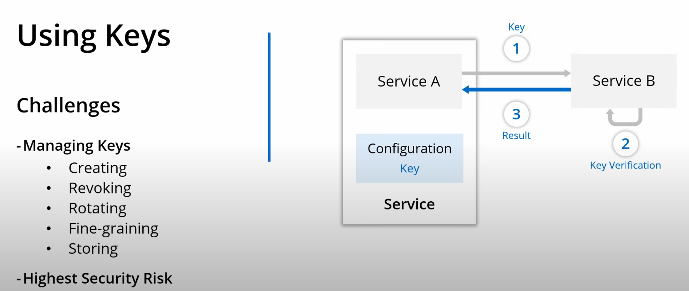

(under constuction)
# Implement Managed Identities for Azure resources

Rsources:
* [Managed Identities with Azure AD (video)](https://youtu.be/sA_mXKy_dKU)
* [Azure Data Factory Tutorial (video)](https://youtu.be/EpDkxTHAhOs)

### Scenario 1: Store keys in a configuration file
Searvice A connects to Service B using a key stored in a configuration file

### Scenario 2: Use Azure AD for authentication accross two services

### Scenario 3: Use IM
