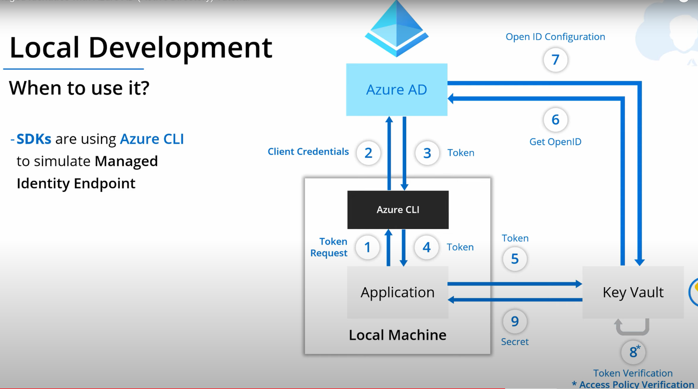

(under constuction)
# Implement Managed Identities for Azure resources

Rsources:
* [Managed Identities with Azure AD (video)](https://youtu.be/sA_mXKy_dKU)
* [Azure Data Factory Tutorial (video)](https://youtu.be/EpDkxTHAhOs)
* [Azure Identity client library for Java](https://github.com/Azure/azure-sdk-for-java/tree/master/sdk/identity/azure-identity)

Examples:
* [Use a managed identity to connect Key Vault to an Azure Spring Cloud app](https://docs.microsoft.com/en-us/azure/spring-cloud/spring-cloud-tutorial-managed-identities-key-vault)

### Scenario 1: Store keys in a configuration file
A **Searvice A** connects to a **Service B** using a key stored in a configuration file. A **Service B** validates a key.

The scenario represents a highest security risk.

### Scenario 2: Use Azure AD for authentication accross two services
Azure AD will manage an authentication process. 

But we still have a challenge to store identity credentials in a configuration file, the same as in the Scenatio1.

### Scenario 3: Use Azure AD Managed Identity

#### Key service characteristic

* Credential are moved out of application code (out of config-files);
* Identity created and tied with resource lifecycle (i.e. when you delete a resource - an identity will be also deleted);
* One click/command to set up with no additional cost;
* Managed Identity are Service Principals of spacial type

### Supported services

IM can be used with the cervices:
* VMs
* App Services
* API Management
* Container Instances
* Container Registry Tasks
* Event Hubs
* Functions
* Kubernetes Services
* Logic Apps
* Service Bus
* Data Factory

### Local development
Managed identity is only enables in Azure service, so how can we locally  develop applications? 
When we run an application on a Local Machine we need to have Azure CLI installed. It will be used instead of Managed Identity Endpoint. 

All SDKs will try to access Managed Identity Endpoint (by default), but if they can not find it - they will use Azure CLI to simulate Managed Identity Endpoint. 

