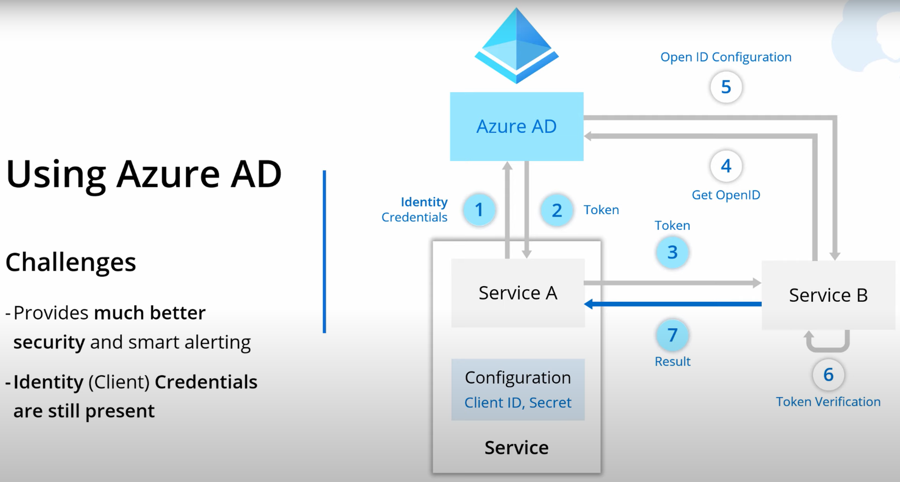

(under constuction)
# Implement Managed Identities for Azure resources

Rsources:
* [Managed Identities with Azure AD (video)](https://youtu.be/sA_mXKy_dKU)
* [Azure Data Factory Tutorial (video)](https://youtu.be/EpDkxTHAhOs)

### Scenario 1: Store keys in a configuration file
A **Searvice A** connects to a **Service B** using a key stored in a configuration file. A **Service B** also performs an authentication.

The scenario represents a highest security risk.

### Scenario 2: Use Azure AD for authentication accross two services
Azure AD will manage an authentication process. 

But we still have a challenge to store identity credentials in a configuration file, the same as in the Scenatio1.

### Scenario 3: Use Azure AD Managed Identity

#### Key service characteristic

* Credential are moved out of application code (out of config-files);
* Identity created and tied with resource lifecycle (i.e. when you delete a resource - an identity will be also deleted);
* One click/command to set up with no additional cost;
* Managed Identity are Service Principals of spacial type

### Supported services

IM can be used with the cervices:
* VMs
* App Services
* API Management
* Container Instances
* Container Registry Tasks
* Event Hubs
* Functions
* Kubernetes Services
* Logic Apps
* Service Bus
* Data Factory
