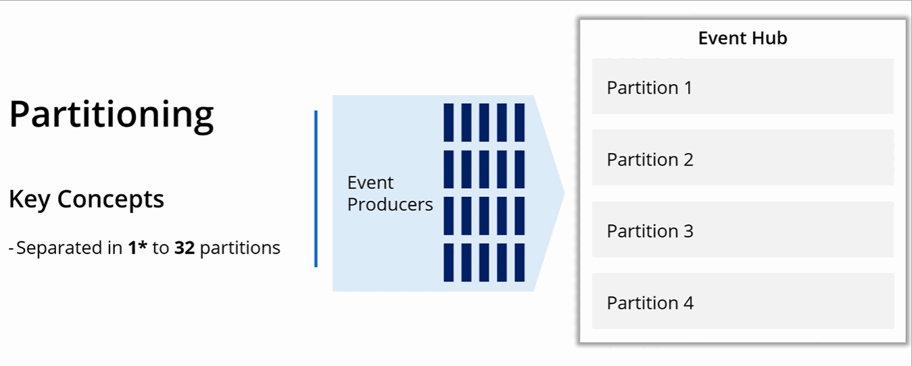

(Under construction)
# Implement solutions that use Azure Event Hub

### Resources
* [Enable reliable messaging for Big Data applications using Azure Event Hubs](https://docs.microsoft.com/en-us/learn/modules/enable-reliable-messaging-for-big-data-apps-using-event-hubs/1-introduction)

### Key Conecpts
To deploy Azure Event Hubs, you must configure an Event Hubs namespace, and then configure the Event Hub itself.

#### Partitioning
- Each Event Hub is partitioned;
- You may have up to 32 patirions (minimum 1);
- You choose partitions when creating e-hub (no way to change it later on);

