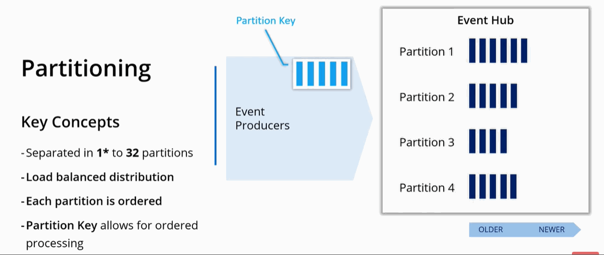

(Under construction)
# Implement solutions that use Azure Event Hub

### Resources
* [Enable reliable messaging for Big Data applications using Azure Event Hubs](https://docs.microsoft.com/en-us/learn/modules/enable-reliable-messaging-for-big-data-apps-using-event-hubs/1-introduction)

### Key Conecpts
To deploy Azure Event Hubs, you must configure an Event Hubs namespace, and then configure the Event Hub itself.

#### Events
- An event is a small packet of information that contains a notification; 
- Events can be published individually, or in batches; 
- A single publication (individual or batch) can't exceed 1 MB.

#### Partitioning
- Each Event Hub is partitioned;
- You may have up to 32 patirions (minimum 1);
- You have to choose partitions when creating e-hub (no way to change it later on);
- When you send messages to e-hub there is no garantie that each partition will be utilized equaly. So, each partition may grow at a different rate:


- All events in a partition are ordered ```older -> newer ``` (like in a queue);
- An order is NOT maintened across partitions;
- If you need to process multiple events in order you need to introduce a *Partition Key*:




#### Namespaces
