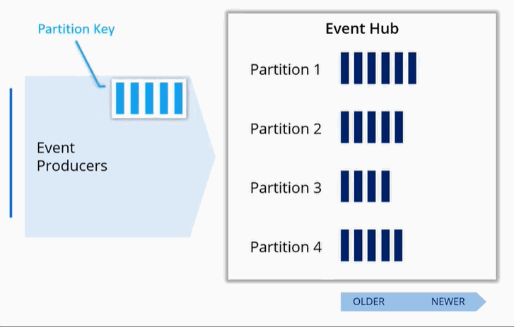

(Under construction)
# Implement solutions that use Azure Event Hub

### Resources
* [Enable reliable messaging for Big Data applications using Azure Event Hubs](https://docs.microsoft.com/en-us/learn/modules/enable-reliable-messaging-for-big-data-apps-using-event-hubs/1-introduction)

### Key Conecpts
To deploy Azure Event Hubs, you must configure an **Event Hubs namespace**, and then configure the **Event Hub** itself.

#### Events
- An event is a small packet of information that contains a notification; 
- Events can be published individually, or in batches; 
- A single publication (individual or batch) can't exceed 1 MB.

#### Partitioning
- Each Event Hub is partitioned;
- You may have up to 32 patirions (minimum 1);
- You have to choose partitions when creating e-hub (no way to change it later on);
- When you send messages to e-hub there is no garantie that each partition will be utilized equaly. So, each partition may grow at a different rate:


- All events in a partition are ordered ```older -> newer ``` (like in a queue);
- An order is NOT maintened across partitions;
- If you need to process multiple events in order you need to introduce a *Partition Key*:




#### Namespaces
- Event hub represents a unique stream of data;
- Event hub namespace is a collection of event hubs
  - Scoping a container;
  - Shared properties
  


### Java-examplea to send/receive events from Azure Event Hubs

#### Send events

```Java
import com.azure.messaging.eventhubs.*;

public class Sender {
    public static void main(String[] args) {
        final String connectionString = "EVENT HUBS NAMESPACE CONNECTION STRING";
        final String eventHubName = "EVENT HUB NAME";

        // 1. create a producer using the namespace connection string and event hub name
        EventHubProducerClient producer = new EventHubClientBuilder()
            .connectionString(connectionString, eventHubName)
            .buildProducerClient();

        // 2. prepare a batch of events to send to the event hub    
        EventDataBatch batch = producer.createBatch();
        batch.tryAdd(new EventData("First event"));
        batch.tryAdd(new EventData("Second event"));
        batch.tryAdd(new EventData("Third event"));
        batch.tryAdd(new EventData("Fourth event"));
        batch.tryAdd(new EventData("Fifth event"));

        // 3. send the batch of events to the event hub
        producer.send(batch);

        // 4. close the producer
        producer.close();
    }
}

```


#### Receive events

```Java
import com.azure.messaging.eventhubs.EventHubClientBuilder;
import com.azure.messaging.eventhubs.EventProcessorClient;
import com.azure.messaging.eventhubs.EventProcessorClientBuilder;
import com.azure.messaging.eventhubs.checkpointstore.blob.BlobCheckpointStore;
import com.azure.messaging.eventhubs.models.ErrorContext;
import com.azure.messaging.eventhubs.models.EventContext;
import com.azure.storage.blob.BlobContainerAsyncClient;
import com.azure.storage.blob.BlobContainerClientBuilder;
import java.util.function.Consumer;
import java.util.concurrent.TimeUnit;

public class Receiver {

    private static final String EH_NAMESPACE_CONNECTION_STRING = "<EVENT HUBS NAMESPACE CONNECTION STRING>";
    private static final String eventHubName = "<EVENT HUB NAME>";
    private static final String STORAGE_CONNECTION_STRING = "<AZURE STORAGE CONNECTION STRING>";
    private static final String STORAGE_CONTAINER_NAME = "<AZURE STORAGE CONTAINER NAME>";

    public static final Consumer<EventContext> PARTITION_PROCESSOR = eventContext -> {
     System.out.printf("Processing event from partition %s with sequence number %d with body: %s %n", 
             eventContext.getPartitionContext().getPartitionId(), eventContext.getEventData().getSequenceNumber(), eventContext.getEventData().getBodyAsString());

        if (eventContext.getEventData().getSequenceNumber() % 10 == 0) {
            eventContext.updateCheckpoint();
        }
    };

    public static final Consumer<ErrorContext> ERROR_HANDLER = errorContext -> {
        System.out.printf("Error occurred in partition processor for partition %s, %s.%n",
            errorContext.getPartitionContext().getPartitionId(),
            errorContext.getThrowable());
    };

    public static void main(String[] args) throws Exception {
        BlobContainerAsyncClient blobContainerAsyncClient = new BlobContainerClientBuilder()
            .connectionString(STORAGE_CONNECTION_STRING)
            .containerName(STORAGE_CONTAINER_NAME)
            .buildAsyncClient();

        EventProcessorClientBuilder eventProcessorClientBuilder = new EventProcessorClientBuilder()
            .connectionString(EH_NAMESPACE_CONNECTION_STRING, eventHubName)
            .consumerGroup(EventHubClientBuilder.DEFAULT_CONSUMER_GROUP_NAME)
            .processEvent(PARTITION_PROCESSOR)
            .processError(ERROR_HANDLER)
            .checkpointStore(new BlobCheckpointStore(blobContainerAsyncClient));

        EventProcessorClient eventProcessorClient = eventProcessorClientBuilder.buildEventProcessorClient();

        System.out.println("Starting event processor");
        eventProcessorClient.start();

        System.out.println("Press enter to stop.");
        System.in.read();

        System.out.println("Stopping event processor");
        eventProcessorClient.stop();
        System.out.println("Event processor stopped.");

        System.out.println("Exiting process");
    }

}

```

