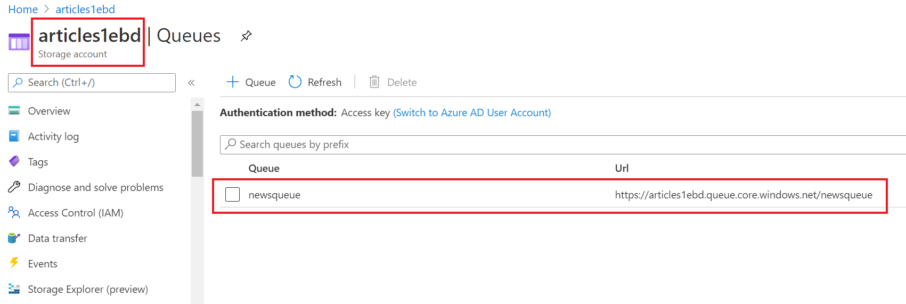
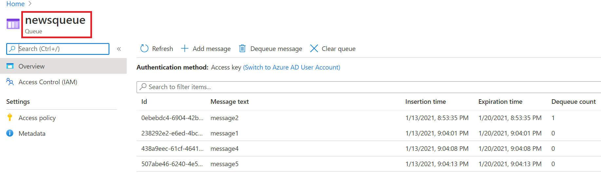

(Under construction)
# Implement solutions that use Azure Queue Storage queues

### Resources
* [Communicate between applications with Azure Queue storage](https://docs.microsoft.com/en-us/learn/modules/communicate-between-apps-with-azure-queue-storage/)


### Top points:
* A single queue can be up to 500 TB in size, so it can potentially store millions of messages. The target throughput for a single queue is 2000 messages per second;
* Queues let your application scale automatically and immediately when demand changes;
* A message in a queue is a byte array of up to 64 KB;
* You access a queue using a REST API: ```http://<storage account>.queue.core.windows.net/<queue name>```


### Exercise

#### 1. Create a storage account




#### 2. Send a message to a queue
```java

    class Program
    {
        private const string ConnectionString = "DefaultEndpointsProtocol=https;AccountName=...";
        static void Main(string[] args)
        {
            string value = String.Join(" ", args);
            SendArticleAsync(value).Wait();
        }

        static async Task SendArticleAsync(string newsMessage)
        {
                //1. Get a storage-account
                CloudStorageAccount storageAccount = CloudStorageAccount.Parse(ConnectionString);

                //2. Create a queue client
                CloudQueueClient queueClient = storageAccount.CreateCloudQueueClient();
                
                //3. Get a reference to a queue
                CloudQueue queue = queueClient.GetQueueReference("newsqueue");
                
                //4. Connect to a queue (or creeate it)                
                bool createdQueue = await queue.CreateIfNotExistsAsync();
                if (createdQueue)
                {
                    Console.WriteLine("The queue of news articles was created.");
                }

                //5. Create a queue-object
                CloudQueueMessage articleMessage = new CloudQueueMessage(newsMessage);
                
                //6. Add the message-object to a queue
                await queue.AddMessageAsync(articleMessage);
        }
    }

```

After sending messaged to a queue they will be shown in the portal:




#### 3. Recieve (and delete) a message from a queue

```java
    class Program
    {
        private const string ConnectionString = "DefaultEndpointsProtocol=https;AccountName=...";
        static void Main(string[] args)            
        {
            ReceiveArticleAsync().Wait();
        }
        static async Task<string> ReceiveArticleAsync()
        {
            //1. Get a storage-account
            CloudStorageAccount storageAccount = CloudStorageAccount.Parse(ConnectionString);
            
            //2. Create a queue client
            CloudQueueClient queueClient = storageAccount.CreateCloudQueueClient();
            
            //3. Get a reference to a queue
            CloudQueue queue = queueClient.GetQueueReference("newsqueue");
        
            bool exists = await queue.ExistsAsync();
            if (exists)
            {
                //4. Get a message-object from a queue
                CloudQueueMessage retrievedArticle = await queue.GetMessageAsync();
                if (retrievedArticle != null)
                {
                    string newsMessage = retrievedArticle.AsString;
                    
                    //5. Delete a message-object from a queue
                    await queue.DeleteMessageAsync(retrievedArticle);
                    
                    Console.WriteLine($"Received {newsMessage}");
                    return newsMessage;
                }
            }
            Console.WriteLine($"Received nothing");
            return "<queue empty or not created>";
        }
    }
```
