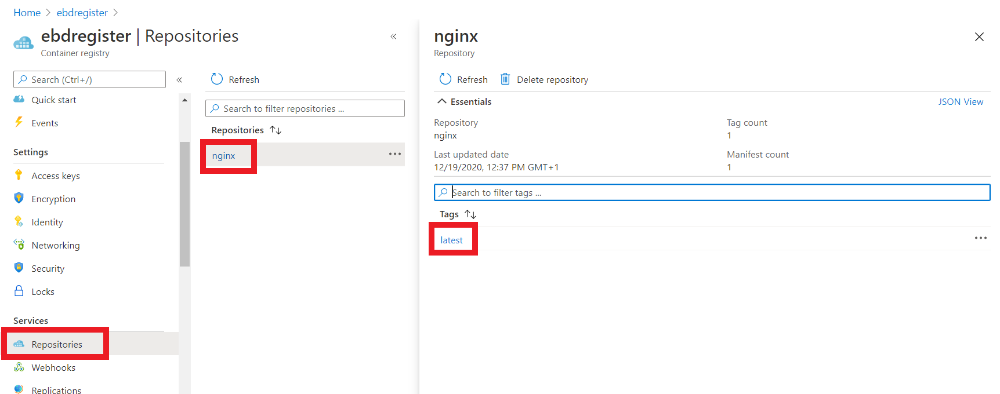
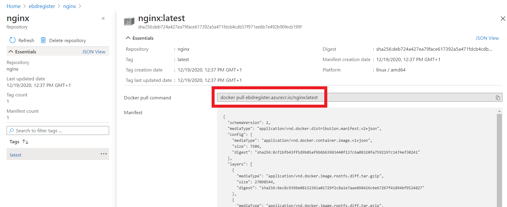
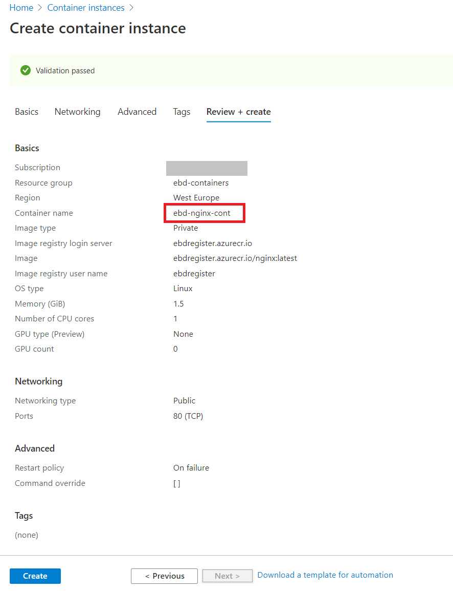
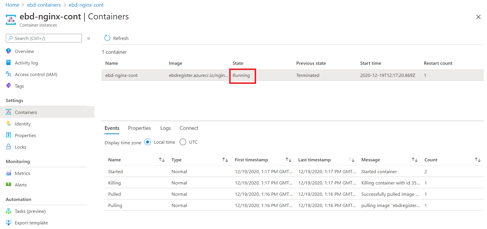
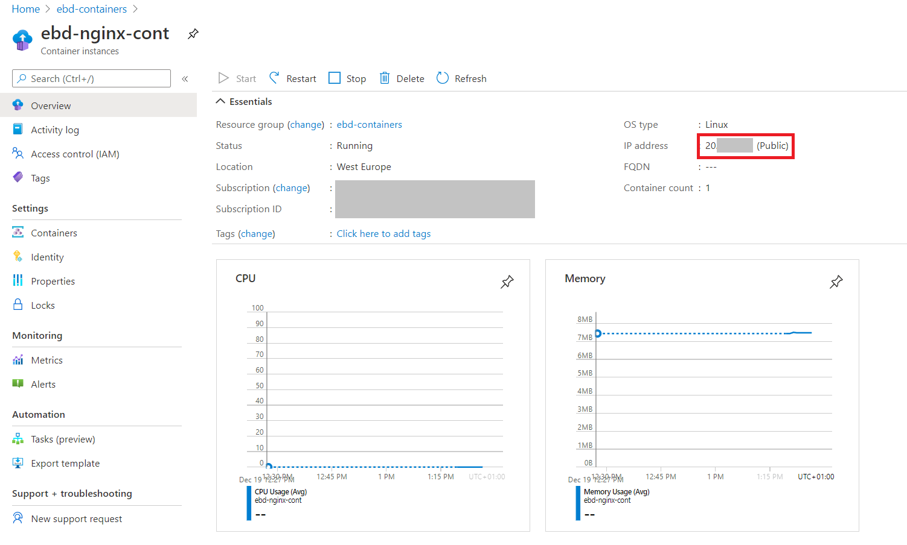
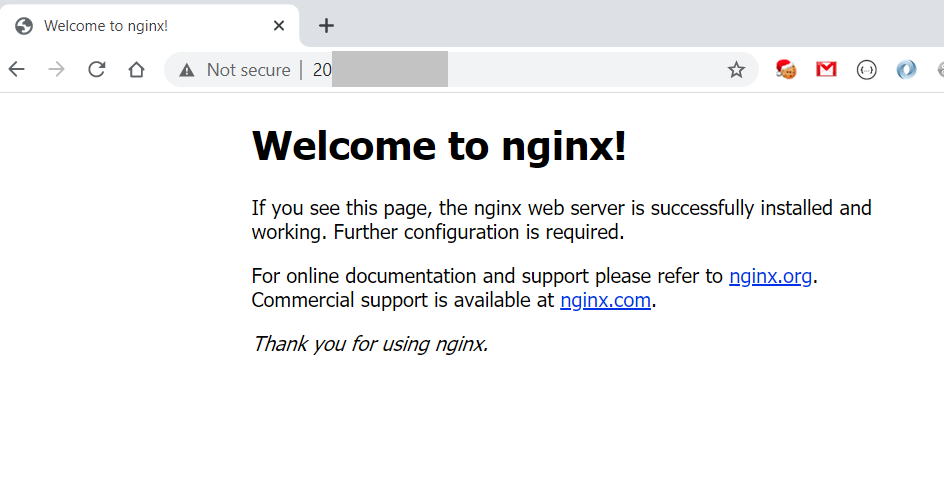

(under construction)
# Azure Container Registry (ACR) and Azure Container Instance (ACI)

1. Create Container registry


This will create ACR for you (your company) for images.

List all ACRs:

```
az acr list -o table
```

2. Log in to a registry

```
az acr login --name myregistry
```
or

```
docker login myregistry.azurecr.io
```

4. Tag an image before pushing it to ACR:
```
docker tag <IMAGE_ID> ebdregister.azurecr.io/nginx:latest
```

5. Publish an image to the ACR:
```
docker push ebdregister.azurecr.io/nginx:latest
```

6. List images in ACR:
```
az acr repository list -n ebdregister
```
You can also check an image in the portal:



Here you can also see a docker pull command:




7. Before deploying to Azure Container Instance (ACI) we need to enable access:


8. Create ACI:



9. Check the created container. Note, it is in a "Running" state:



Note the IP address of the running instance:



10. Make a call to the container from your browser:




