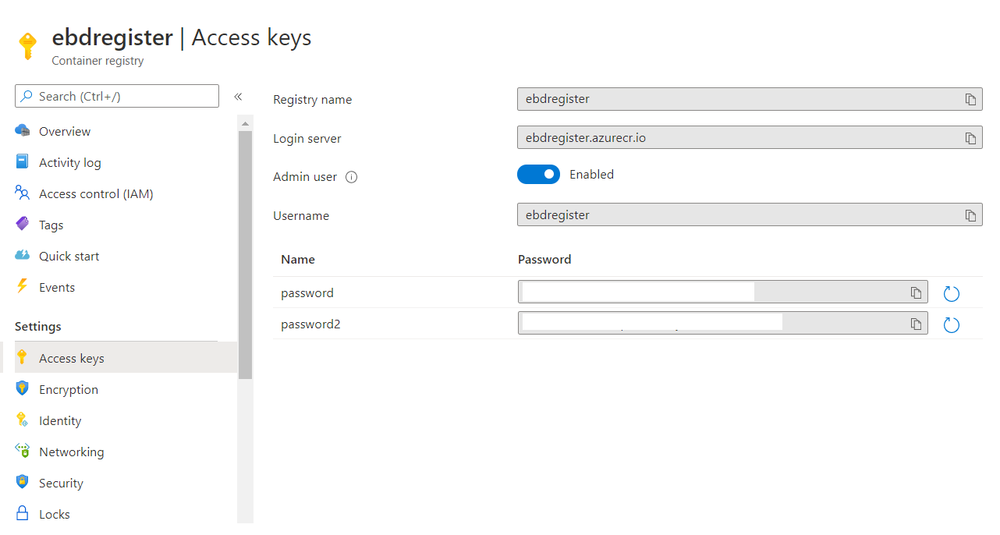

(under construction)
# Azure Container Registry and Azure Container Instance

1. Create Container registry


This will create a container for you (your company) for images.



Username and password(s) will be created (needed to be used later)

List all ACRs:

```
az acr list -o table
```

2. Log in to a registry

```
az acr login --name myregistry
```
or

```
docker login myregistry.azurecr.io
```

4. Tag an image before pushing it to ACR:
```
docker tag <IMAGE_ID> ebdregister.azurecr.io/nginx:latest
```

5. Publish an image to the ACR:
```
docker push ebdregister.azurecr.io/nginx:latest
```

6. List images in ACR:
```
az acr repository list -n ebdregister
```


